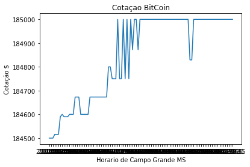
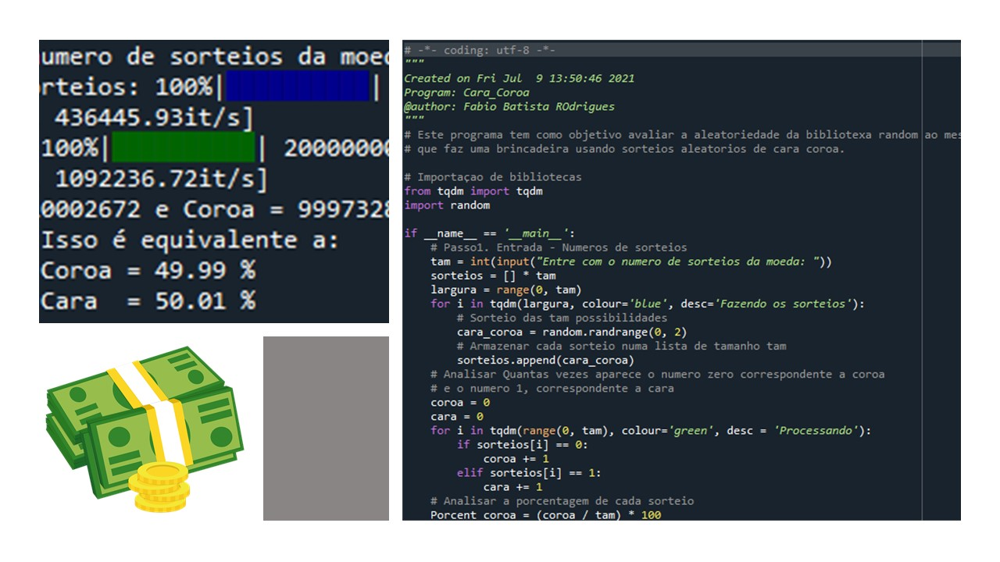
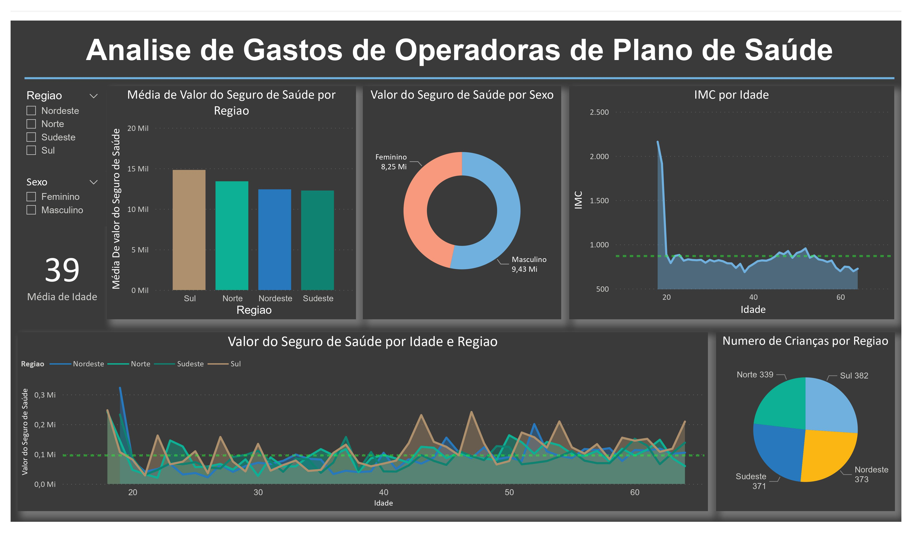
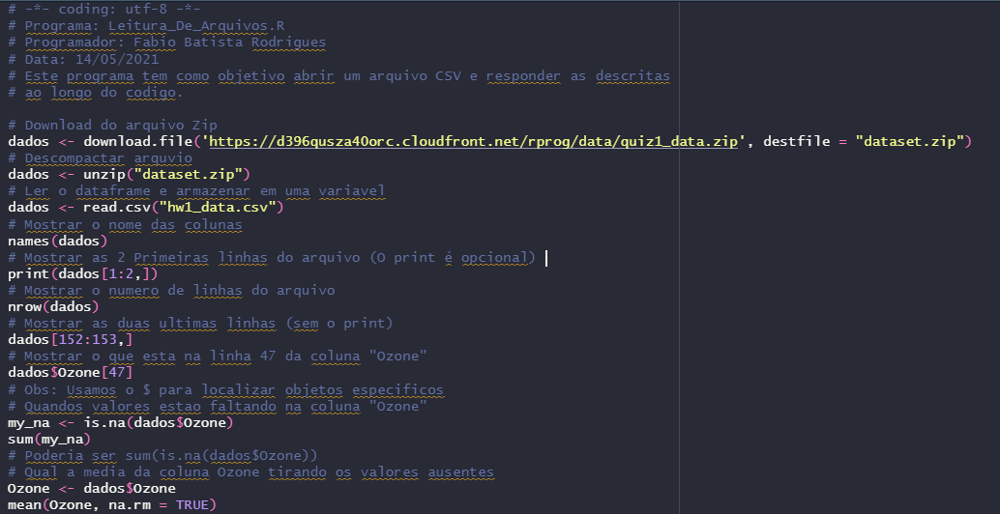

# Fabio Rodrigues Portfolio
Portfolio that contains my Data Science Projects

## Sumario
* ### Projetos em Linguagem Python
  * [BitCoin Quote Analysis](#ProjectPython_1)
  * [Head Tails](#ProjectPython_2)

* ### Projetos Power BI
  * [Analysis of Healthcare Operators](#ProjectBI_1)

* ### Projetos em Linguagem R
  * [Reading CSV files](#ProjectR_1)

# Python Projects

## BitCoin Quote Analysis 
[Link do Arquivo](https://github.com/fabiobr05/Cotacao_Bitcoin)

Este projeto faz parte de um dos meus primeiros desejos quando aprendi python.
Se eu te digo, baixe dados de uma API que sao atualizados constantimente e ao final de um tempo pre determinado plot um grafico mostrando a evolução temporal do que foi analisado. Você conseguiria?
Pois bem, ai esta!
Um projeto bem simples com muitas sutilizas que vai lhe ajudar a evoluir na ciencia de dados. Bom proveito!

## Head Tails 
[Link do Arquivo](https://github.com/fabiobr05/Cara_Coroa)

Cara ou Coroa é um jogo simples, que consiste em se atirar uma moeda ao ar para então verificar qual de seus lados ficou voltado para cima após sua queda. É comumente utilizado para se escolher entre duas alternativas ou para resolver uma disputa entre duas partes. Esse método de escolha tem necessariamente apenas duas possibilidades de resultado, as quais têm a mesma probabilidade de ocorrência.[Wikipédia](https://pt.wikipedia.org/wiki/Cara_ou_coroa) 
Este programa consiste em avaliar a probabilidade de ocorrer cara ou coroa dado um numero de sorteios sempre aleatório. Ótimo para uso didático e da biblioteca random. Bom proveito!

# BI Projects

## Analysis of Healthcare Operators' Expenditures 
[Link do Arquivo](https://github.com/fabiobr05/PowerBI_1)

Esse é um projeto guiado que faz parte do curso [Microsoft Power BI para Data Science Versao 2.0](https://www.datascienceacademy.com.br/course?courseid=microsoft-power-bi-para-data-science) da datascienceacademy.com.br

O Dataset foi usado no decorrer do curso, voce pode encontralo no Cap7.

Para efeito de estudo:
  * No proprio arquivo pbix voce consegue conferir todas as alteraçoes feitas nos dados converindo o Power Query.

# Projects in R language

## Reading CSV files 
[Link do Arquivo](https://github.com/fabiobr05/Reading_CSV_files)

Este projeto tem como objetivo apresentar a estração de dados de um banco Web
É um codigo muito simples com algumas sutilezas que vão ajudar qualquer um que esteja tentando entrar na carreira de ciencia de dados.
É recomendado que use o Rstudio como IDE para uma maior agilidade dos processos.
