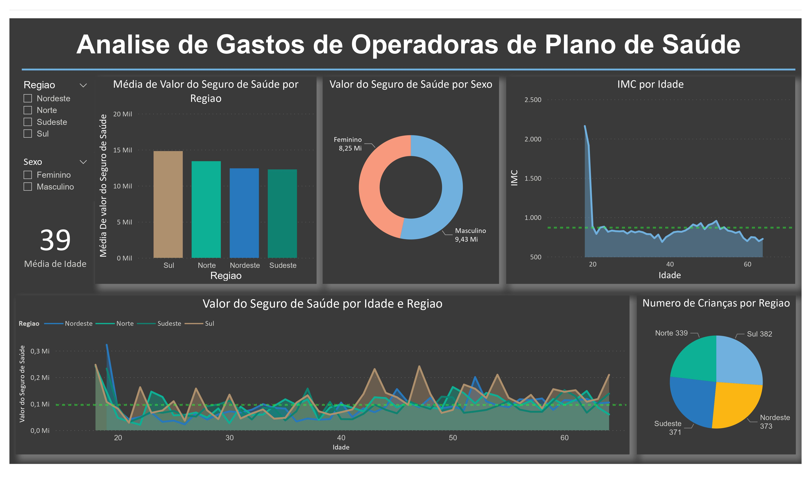

# Fabio Rodrigues Portfolio
Portfolio thar contains my Data Science Projects

## [Project 1: Analysis of Healthcare Operators' Expenditures](https://github.com/fabiobr05/PowerBI_1)
Link para repositorio

Esse é um projeto guiado que faz parte do curso [Microsoft Power BI para Data Science Versao 2.0](https://www.datascienceacademy.com.br/course?courseid=microsoft-power-bi-para-data-science) da datascienceacademy.com.br

O Dataset foi usado no decorrer do curso, voce pode encontralo no Cap7.

Para efeito de estudo:
  * No proprio arquivo pbix voce consegue conferir todas as alteraçoes feitas nos dados converindo o Power Query.
  
